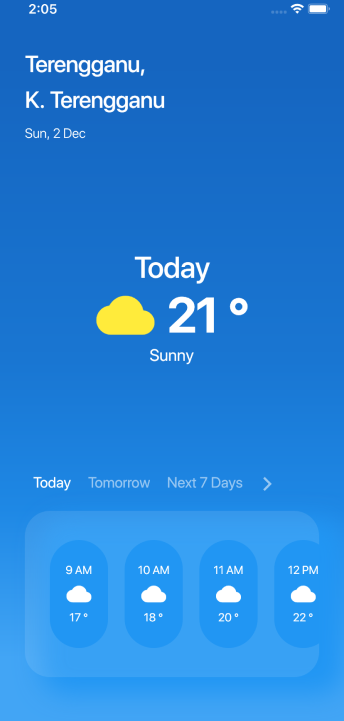

# Weather Apps UI using Flutter 

### This is original mockup design from dribbble

### This is what i'd build using flutter

>This flutter is just another my learning process for mobile development. 

 Previously im using react native for mobile development purpose.

Do contact me for any question at mtajulasri@gmail.com